# Схема БД (актуальная)

Источник: `alembic/versions/` + `src/migrate/models.py`. Head: `0014_clearcut_limitation_dt`.

```mermaid
erDiagram
  alembic_version {
    varchar version_num PK
  }
  taxation_piece {
    varchar fgis_id PK "учётный номер выдела ФГИС ЛК, уникален"
    varchar subject "субъект, индекс"
    varchar taxation_piece "номер выдела"
    varchar quarter "номер квартала"
    numeric area "площадь"
    varchar status "status"
    date read_at "дата чтения из СПД, индекс с субъектом"
    date actuality_date "дата актуальности (появление в ФГИС ЛК)"
    int semantic_id "идентификатор семантики WFS"
    geometry geom "контур, gist"
    varchar crs "система координат СПД"
  }
  quarters {
    varchar fgis_id PK "учётный номер квартала ФГИС ЛК, уникален"
    varchar subject "субъект, индекс"
    varchar subforestry "участковое лесничество"
    varchar quarter "номер квартала"
    varchar tract "урочище"
    varchar status "status"
    date read_at "дата чтения из СПД, индекс с субъектом"
    date actuality_date "дата актуальности (появление в ФГИС ЛК)"
    int semantic_id "идентификатор семантики WFS"
    geometry geom "контур, gist"
    varchar crs "система координат СПД"
    date clearcut_polled_at "дата опроса лесосек, индекс с субъектом"
    boolean has_clearcuts "есть лесосеки"
  }
  clearcut {
    varchar fgis_id PK "учётный номер лесосеки ФГИС ЛК, уникален"
    varchar subject "субъект, индекс"
    varchar quarter "номер квартала"
    numeric area "площадь"
    varchar status "status"
    date read_at "дата чтения из СПД, индекс с субъектом"
    date actuality_date "дата актуальности (появление в ФГИС ЛК)"
    int semantic_id "идентификатор семантики WFS"
    geometry geom "контур, gist"
    varchar crs "система координат СПД"
    date limitation_dt "дата отвода"
    varchar clearcut_no "номер лесосеки"
    varchar basis_doc_no "номер документа-основания"
  }
  fgis_import_history {
    int id PK
    varchar subject "субъект"
    date day "последний день закрытого окна"
    date period_start "начало окна СПД"
    date period_end "конец окна СПД"
    varchar result "ok / error"
    int updated_count "сколько строк upsert"
    varchar data_kind "вид данных"
    text error "текст ошибки"
    timestamptz ran_at "когда записали"
  }
```

| Объект | Назначение |
| --- | --- |
| extension `postgis` | геометрия (миграция `0001_postgis`) |
| `alembic_version` | текущая revision |
| `taxation_piece` | выдел: семантика + контур (`0002`) + `read_at` (`0005`) + `actuality_date` (`0006`) + `semantic_id` (`0007`) + `crs` (`0010`) + PK `fgis_id` (`0013`) |
| `quarters` | квартал: семантика + контур (`0008`) + `crs` (`0010`) + опрос лесосек (`0011`) + PK `fgis_id` (`0013`) |
| `clearcut` | лесосека: семантика + контур (`0009`) + `crs` (`0012`) + PK `fgis_id` (`0013`) + `limitation_dt` date (`0014`) |
| `fgis_import_history` | журнал прогонов fgislk (`0003` + окно `0004_fgis_import_period`) |
| таблицы PostGIS (`spatial_ref_sys` и др.) | ставит расширение, не описывать в `models.py` |

Связь с другими разделами — учётный номер `fgis_id` (см. [`spatialData/CONTEXT.md`](../spatialData/CONTEXT.md)). Watermark ежедневного импорта — `MAX(day)` успешных строк `fgis_import_history` по субъекту и `data_kind`. Аудит не ходит в СПД за карточкой, если `read_at` не старше 2 дней (МСК).
