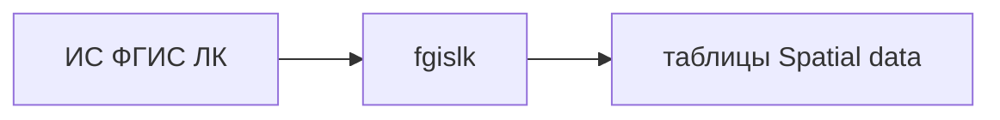

# Spatial data

## Назначение и границы

Предметная область геоданных: кварталы, выделы, лесосеки, лесные участки. Прикладные таблицы в общей PostGIS (**семантика + координаты** в одной строке).

Не отдельный HTTP-процесс: DDL — `migrate`, загрузка — fgislk. Карта, формы, XML, PDF и СМЭВ в контур не входят. Отдельный ГИС-сервер в контур не входит, пока не понадобится. В `admin` — карточка-заглушка (нет HTTP-процесса).

Не дублировать здесь общую архитектуру репозитория — см. [`Архитектура.md`](../Архитектура.md).

## Требования

- Типы объектов: квартал, выдел, лесосека, лесной участок — каждый своей таблицей. Имена колонок — латиница, смысл — перевод (комментарий).
- Геометрия — PostGIS в тех же строках, что и атрибуты; не отдельный «файл контура».
- Контур квартала и выдела — как в СПД: без `ST_Transform`, без перестановки осей (путаница `latitude`/`longitude` не чинится). `geom` без фиксированного SRID. `crs` — `coordinateSystemCode`. WKT: `x` = `longitude`, `y` = `latitude`.
- Связь между разделами и между объектами — учётный номер ФГИС ЛК, не внутренний UUID наружу. Субъект — контур учёта и фильтр, не часть уникального ключа:

| Поле | Колонка | Роль |
| --- | --- | --- |
| Учётный номер ФГИС ЛК | `fgis_id` | уникальный идентификатор объекта в ИС ФГИС ЛК (PK) |
| Субъект | `subject` | субъект РФ (контур учёта) |

- Актуальные имена таблиц после миграций — [`migrate/schema.md`](../migrate/schema.md).

Первая таблица — **выдел** (`taxation_piece`):

| Колонка | Тип | Перевод |
| --- | --- | --- |
| `fgis_id` | varchar(50), PK | учётный номер выдела ФГИС ЛК |
| `subject` | varchar(3), индекс | субъект |
| `taxation_piece` | varchar(10) | номер выдела |
| `quarter` | varchar(20) | номер квартала |
| `area` | numeric(16, 5) | площадь |
| `status` | varchar(10) | status |
| `read_at` | date | дата чтения из СПД |
| `actuality_date` | date | дата актуальности (появление в ФГИС ЛК, `modifyDttm` СПД) |
| `semantic_id` | integer | идентификатор семантики (`TAXATION_PIECE.{id}`) |
| `geom` | geometry без SRID | контур как в СПД |
| `crs` | varchar(50) | `coordinateSystemCode` СПД |

Таблица **лесосека** (`clearcut`):

| Колонка | Тип | Перевод |
| --- | --- | --- |
| `fgis_id` | varchar(50), PK | учётный номер лесосеки ФГИС ЛК |
| `subject` | varchar(3), индекс | субъект |
| `quarter` | varchar(20) | номер квартала |
| `area` | numeric(16, 5) | площадь |
| `status` | varchar(10) | status |
| `read_at` | date | дата чтения из СПД |
| `actuality_date` | date | дата актуальности (появление в ФГИС ЛК, `modifyDttm` СПД) |
| `semantic_id` | integer | идентификатор семантики (`CLEARCUT.{id}`) |
| `geom` | geometry | контур |
| `crs` | varchar(50) | `coordinateSystemCode` СПД |
| `limitation_dt` | varchar(20) | дата отвода (`limitationDt` СПД) |
| `clearcut_no` | varchar(50) | номер лесосеки |
| `basis_doc_no` | varchar(50) | номер документа-основания |

Таблица **квартал** (`quarters`):

| Колонка | Тип | Перевод |
| --- | --- | --- |
| `fgis_id` | varchar(50), PK | учётный номер квартала ФГИС ЛК |
| `subject` | varchar(3), индекс | субъект |
| `subforestry` | varchar(10) | участковое лесничество |
| `quarter` | varchar(10) | номер квартала |
| `tract` | varchar(150) | урочище |
| `status` | varchar(10) | status |
| `read_at` | date | дата чтения из СПД |
| `actuality_date` | date | дата актуальности (появление в ФГИС ЛК, `modifyDttm` СПД) |
| `semantic_id` | integer | идентификатор семантики (`QUARTER.{id}`) |
| `geom` | geometry без SRID | контур как в СПД |
| `crs` | varchar(50) | `coordinateSystemCode` СПД |
| `clearcut_polled_at` | date | дата успешного опроса лесосек по кварталу |
| `has_clearcuts` | boolean | в квартале есть лесосеки (после опроса) |

## Ограничения и допущения

- Одна PostGIS на все прикладные данные; без второй гео-БД «на вырост».
- fgislk не публикует карту; публикация слоёв отдельным приложением — не в контуре.
- Схема таблиц меняется только через `migrate`; наполнение — fgislk.

## Интерфейсы

- **migrate:** DDL таблиц Spatial data, расширение PostGIS.
- **fgislk:** запись семантики и контура из ИС ФГИС ЛК (СПД) в таблицы.
- **admin:** нет HTTP этого раздела; карточка-заглушка в каталоге admin.
- Чтение: SQL к общей БД по **учётному номеру ФГИС ЛК** (`fgis_id`); субъект — фильтр; отдельного прикладного HTTP для выборки нет.

## Архитектура решения

По `fgis_id` стыкуются объекты между собой и с остальными разделами системы.
