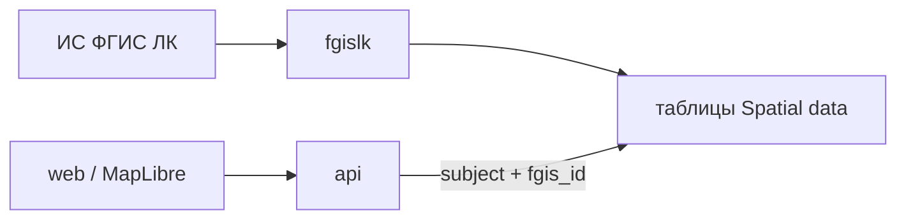

# Spatial data

## Назначение и границы

Предметная область геоданных: кварталы, выделы, лесосеки, лесные участки. Прикладные таблицы в общей PostGIS (**семантика + координаты** в одной строке).

Не отдельный HTTP-процесс: DDL — `migrate`, загрузка — fgislk, карта и выборки — `web` / `api`. Отдельный ГИС-сервер в контур не входит, пока не понадобится.

Не дублировать здесь общую архитектуру репозитория — см. [`Архитектура.md`](../Архитектура.md).

## Требования

- Типы объектов: квартал, выдел, лесосека, лесной участок — каждый своей таблицей. Имена колонок — латиница, смысл — перевод (комментарий).
- Геометрия — PostGIS в тех же строках, что и атрибуты; не отдельный «файл контура».
- Связь между разделами и между объектами — пара полей, не внутренний UUID наружу:

| Поле | Колонка | Роль |
| --- | --- | --- |
| Субъект | `subject` | субъект РФ (контур учёта) |
| Учётный номер ФГИС ЛК | `fgis_id` | идентификатор объекта в ИС ФГИС ЛК |

- Браузер в Postgres не ходит: прикладное — через `api`, карта — через `web` (не напрямую в БД).
- Актуальные имена таблиц после миграций — [`migrate/schema.md`](../migrate/schema.md).

Первая таблица — **выдел** (`taxation_piece`):

| Колонка | Тип | Перевод |
| --- | --- | --- |
| `fgis_id` | varchar(50), индекс | учётный номер выдела ФГИС ЛК |
| `subject` | varchar(3), индекс | субъект |
| `taxation_piece` | varchar(10) | номер выдела |
| `quarter` | varchar(20) | номер квартала |
| `area` | numeric(16, 5) | площадь |
| `status` | varchar(10) | status |
| `read_at` | date | дата чтения из СПД |
| `geom` | geometry | контур |

## Ограничения и допущения

- Одна PostGIS на все прикладные данные; replica на чтение карты — позже, без второй гео-БД «на вырост».
- fgislk не публикует карту; публикация слоёв отдельным приложением — не на старте.
- Схема таблиц меняется только через `migrate`; наполнение — fgislk.

## Интерфейсы

- **migrate:** DDL таблиц Spatial data, расширение PostGIS.
- **fgislk:** запись из ИС ФГИС ЛК (СПД, WFS) в таблицы.
- **api:** выборки и привязка по **субъект** + **учётный номер ФГИС ЛК**.
- **web:** карта и оболочка; в Postgres не ходит.

## Архитектура решения

По паре `subject` + `fgis_id` стыкуются объекты между собой и с остальными разделами системы.
