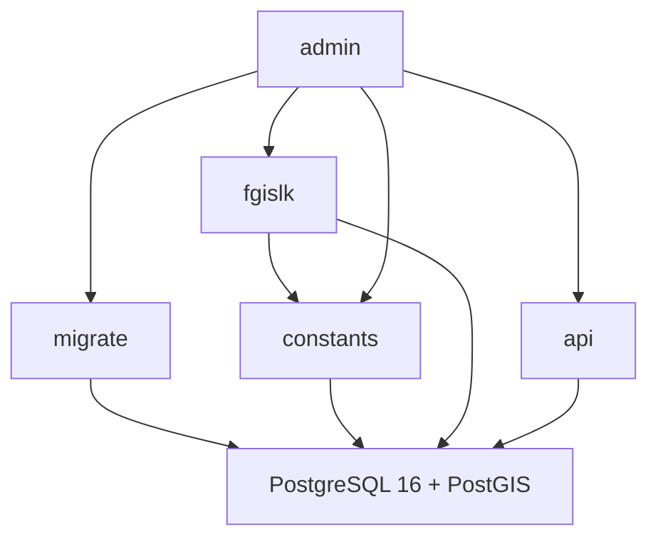

# Архитектура

Несколько приложений, одна PostgreSQL 16 + PostGIS (НСИ, геометрия). Нет своей БД на раздел, Kafka, k8s, mesh, HTTP-прокси к таблицам.

Разделы **можно и нужно** делать отдельными приложениями (`migrate`, `constants`, `fgislk`, `api`, `admin`) — все смотрят в одну БД (admin в БД не ходит). Это не микросервисы «сервис = своя база».

Ограничения при общей БД: схема меняет только `migrate`; приложения проверяют `alembic_revision` и не стартуют при mismatch.

**Один git-репозиторий, разделы — папки, запуск — несколько процессов** (не пять git-проектов и не один процесс на всё).

```
migrate/       # схема, Alembic, /ready; визуал БД: schema.md
constants/     # прикладные настройки: таблица constant, типизированный HTTP
fgislk/        # импорт в слои PostGIS (СПД)
spatialData/   # Spatial data: кварталы, выделы, слои, ключи связи
api/           # read-only HTTP для внешних ИС
admin/         # тонкая витрина HTTP разделов для оператора
```

ИИ: в чат кладут папку раздела + `CONTEXT.md`, не весь репозиторий. Один репо контекст не раздувает; несколько репо — хуже (агент не видит схему рядом с fgislk). Шаблон `CONTEXT.md` (пять заголовков): [`AGENTS.md`](AGENTS.md).

Публикация: один образ или один репо → сервисы Compose (`migrate`, `constants`, `fgislk`, `api`, `admin`). Проще, чем отдельные pipeline.

Не сливать migrate+constants+fgislk+api в **один процесс**: рестарт выдачи не гасит импорт; `upgrade` не должен идти из constants, fgislk и api. Прикладной UI, карта, XML, PDF и СМЭВ в контур не входят. `admin` — только витрина уже существующих HTTP разделов.



| Приложение | Роль |
| --- | --- |
| PostgreSQL | Данные |
| `migrate` | Alembic `upgrade head` при выкладке; единственный мигратор |
| `constants` | Типизированные прикладные настройки; единственный процесс к таблице `constant` |
| `fgislk` | Загрузка пространственных слоёв и прочих данных из ИС ФГИС ЛК (СПД) |
| `api` | Read-only HTTP для внешних ИС (выборки Spatial data) |
| `admin` | Страница оператора: статус, кнопки и таблицы через HTTP разделов |

Контекст разделов: `*/CONTEXT.md`. Навигация и шаблон: [`AGENTS.md`](AGENTS.md).

## Доступ к СУБД

Не в коде и не на страницах статуса. Строка подключения — **переменные окружения** (Compose / `.env`, файл не в git).

| Приложение | Переменные |
| --- | --- |
| все, кто пишет/читает ИБ | `POSTGRES_*` из `.env` — одна и та же БД |
| `migrate` | тот же URL (нужны права DDL: `CREATE`/`ALTER`) |
| `constants` | тот же URL; единственный читатель/писатель таблицы `constant` |
| `fgislk` | тот же URL (слои СПД); прикладные настройки — `CONSTANTS_URL`, не выборка из `constant` |
| `api` | тот же URL; драйвер свой (psycopg); только чтение слоёв |
| `admin` | в Postgres не ходит; `MIGRATE_URL`, `CONSTANTS_URL`, `FGISLK_URL`, `API_URL` |
| потребители схемы | `MIGRATE_URL` — `http://…` для `/ready` |
| потребители настроек | `CONSTANTS_URL` — `http://…` для `/items` |

На старте: один `.env.example` в корне репозитория, Compose прокидывает в сервисы. Пароль БД не в репозитории и не на экране статусов. Прикладные константы (не `POSTGRES_*`, не порты и не URL процессов) — в таблице `constant`, не в `.env` после сида миграции.

Позже можно развести роли Postgres (migrate = DDL, fgislk = DML, api = SELECT). На старте — один пользователь.

## Стек

Python 3, FastAPI, Alembic, Docker Compose. Не брать: Redis/Kafka «на вырост», gRPC. Нет React/Vite/MapLibre, XML, PDF и СМЭВ.

Миграции только `migrate`. `constants`, `fgislk` и `api` Alembic не вызывают. `/health`: версия приложения + `alembic_revision`; mismatch схемы — отказ стартовать. Статус процессов — их HTTP `/health` и `/status`. `admin` — тонкая HTML-витрина этих ответов и команд раздела; не оркестратор и не источник правды.

Масштаб: вертикаль Postgres. Импорт — лимиты к ФГИС, не N реплик fgislk без координации.

Spatial data (кварталы, выделы, лесосеки, участки, ключи связи) — [`spatialData/CONTEXT.md`](spatialData/CONTEXT.md).

## Порядок

1. Репозиторий, Compose (PostGIS), `migrate` (job `upgrade head`, сид констант).
2. `constants`.
3. `fgislk` и `api`.
4. `admin` (витрина, после migrate и constants).
