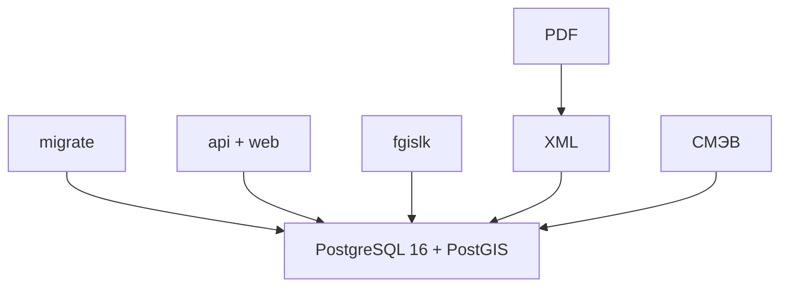

# Архитектура

Несколько приложений, одна PostgreSQL 16 + PostGIS (НСИ, геометрия). Нет своей БД на раздел, Kafka, k8s, mesh, HTTP-прокси к таблицам.

Разделы **можно и нужно** делать отдельными приложениями (`migrate`, `api`+`web`, `fgislk`, позже XML/PDF/СМЭВ) — все смотрят в одну БД. Это не микросервисы «сервис = своя база».

Ограничения при общей БД: схема меняет только `migrate`; приложения проверяют `alembic_revision` и не стартуют при mismatch.

**Один git-репозиторий, разделы — папки, запуск — несколько процессов** (не пять git-проектов и не один процесс на всё).

```
migrate/       # схема, Alembic, /ready; визуал БД: schema.md
api/
web/
fgislk/        # импорт в слои PostGIS (СПД, WFS)
spatialData/   # Spatial data: кварталы, выделы, слои, ключи связи
```

ИИ: в чат кладут папку раздела + `CONTEXT.md`, не весь репозиторий. Один репо контекст не раздувает; несколько репо — хуже (агент не видит схему рядом с api). Шаблон `CONTEXT.md` (пять заголовков): [`AGENTS.md`](AGENTS.md).

Тесты: один Compose, pytest по пакетам (`tests/migrate`, `tests/api`, …). Публикация: один образ или один репо → сервисы Compose (`migrate`, `api`, `fgislk`). Проще, чем отдельные pipeline.

Не сливать migrate+api+fgislk в **один процесс**: рестарт `fgislk` не должен ронять UI; `upgrade` не должен идти из api. СМЭВ — отдельный репозиторий только при изолированном контуре.



| Приложение | Роль |
| --- | --- |
| PostgreSQL | Данные |
| `migrate` | Alembic `upgrade head` при выкладке; единственный мигратор |
| `api` + `web` | Формы, карта, HTTP |
| `fgislk` | Загрузка пространственных слоёв и прочих данных из ИС ФГИС ЛК (СПД, WFS) |
| XML / PDF / СМЭВ | Отдельные приложения позже |

Контекст разделов: `*/CONTEXT.md`. Навигация и шаблон: [`AGENTS.md`](AGENTS.md).

## Доступ к СУБД

Не в коде и не в UI. Строка подключения — **переменные окружения** (Compose / `.env`, файл не в git).

| Приложение | Переменные |
| --- | --- |
| все, кто пишет/читает ИБ | `POSTGRES_*` из `.env` — одна и та же БД |
| `migrate` | тот же URL (нужны права DDL: `CREATE`/`ALTER`) |
| `api`, `fgislk`, позже XML/PDF | тот же URL; драйвер свой (asyncpg / psycopg) |
| `web` | **нет** доступа к Postgres; карта — `api`, не JDBC |
| потребители схемы | `MIGRATE_URL` — `http://…` для `/ready` |

На старте: один `.env.example` в корне репозитория, Compose прокидывает в сервисы. Пароль не в репозитории и не на экране статусов.

Позже можно развести роли Postgres (migrate = DDL, api = DML). На старте — один пользователь.

## Стек

Python 3, FastAPI, Alembic, Docker Compose, React + Vite + MapLibre, nginx. XML: `lxml`. PDF: WeasyPrint или LibreOffice. Очереди: таблицы Postgres (`exchanges`). Не брать: Redis/Kafka «на вырост», gRPC.

Миграции только `migrate`. `api` и `fgislk` Alembic не вызывают. `/health`: версия приложения + `alembic_revision`; mismatch схемы — отказ стартовать. Статус компонентов — страница в UI (чтение `/health`), не оркестратор.

Масштаб: вертикаль Postgres, replica на чтение карты. Импорт — лимиты к ФГИС, не N реплик fgislk без координации.

Spatial data (кварталы, выделы, лесосеки, участки, ключи связи) — [`spatialData/CONTEXT.md`](spatialData/CONTEXT.md).

## Порядок

1. Репозиторий, Compose (PostGIS), `migrate` (job `upgrade head`).
2. `api` + `web` (карта) + `fgislk`.
